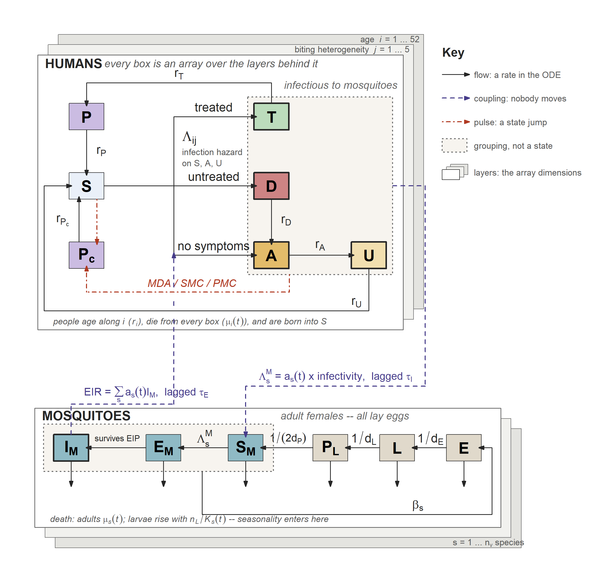
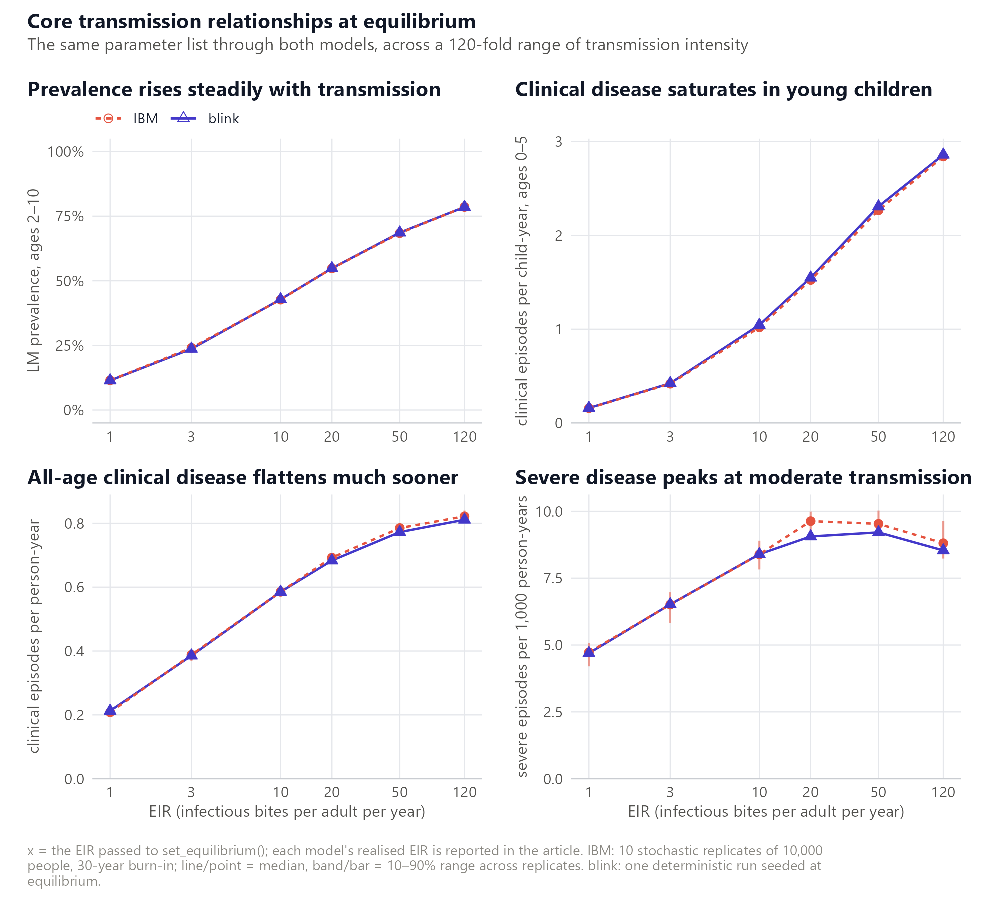
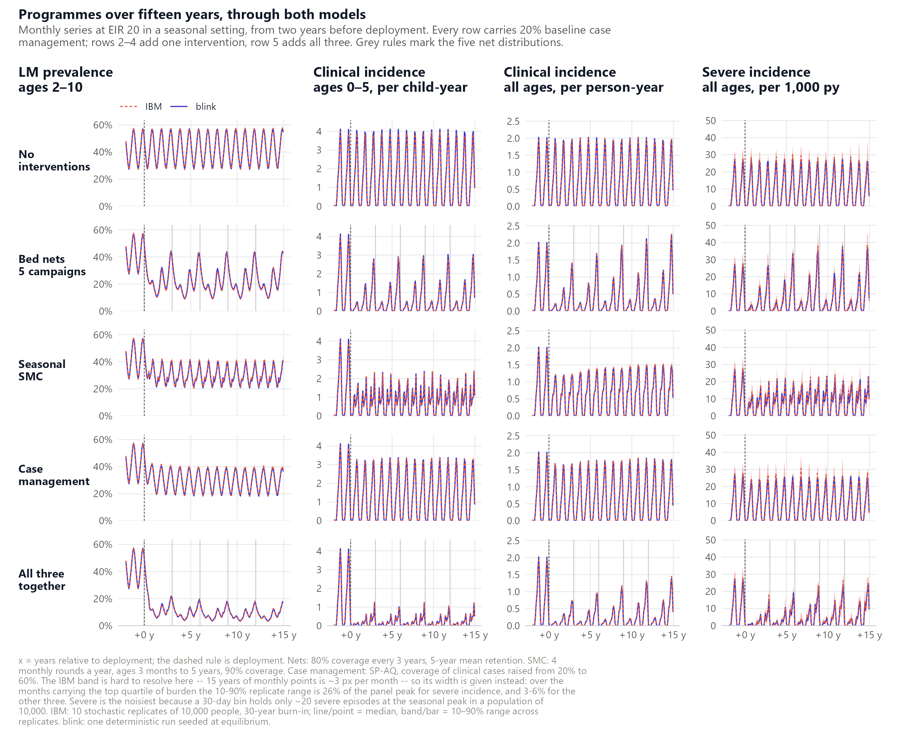
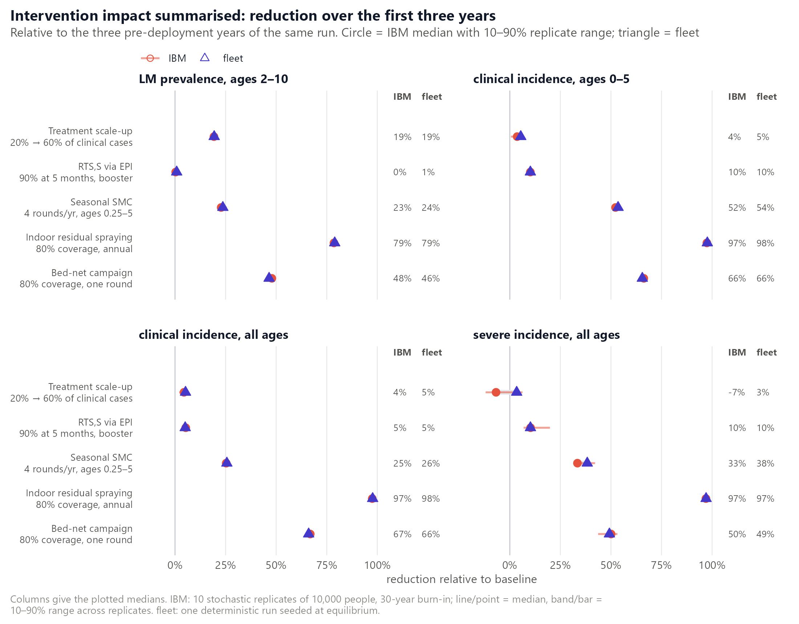
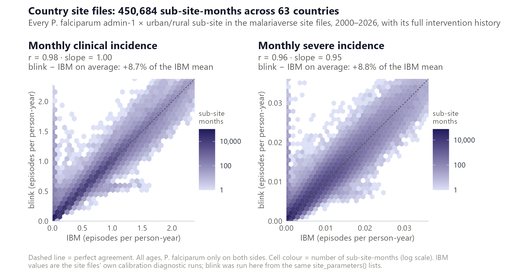

# blink

> A fast, deterministic **mean-field (ODE) twin** of the [malariasimulation](https://github.com/mrc-ide/malariasimulation) individual-based model of *Plasmodium falciparum* malaria: same inputs, seconds per run, population-independent.



*The model at a glance: humans above, mosquitoes below, the transmission cycle
running counter-clockwise. Solid black = a flow of individuals, a rate in the ODE.
Dashed indigo = a scalar coupling, where nobody moves. Dashed red = a discrete state
jump. Dotted grey = a grouping, never a compartment: the infectious pool and the
adult females. Offset layers = the array dimensions, and only those: the deck behind
the human panel is the age × biting-heterogeneity grid, the deck behind the mosquito
panel is species. Not drawn, to keep the figure readable: P, P~c~ and the EIP are
Erlang chains rather than single compartments (stage counts vary by drug); immunity
is algebraic rather than a state, so it is named on the hazard instead of boxed; and
T splits under antimalarial resistance. All three are in `vignette("model")`.*

## What it is

`blink` reproduces the Griffin-style, age- and biting-heterogeneity-structured human model: states `S / D / A / U / Tr` plus two prophylaxis compartments (`Ph`, treatment-linked, and `Ph_c`, chemoprevention) and the six immunity functions — four acquired states (`IB / ICA / ID / IVA`) plus the two maternal terms (`ICM / IVM`), which are algebraic rather than state variables. The human model is coupled to the compartmental mosquito model (`E / L / P / Sm / EIP-chain / Im` per species). It is written in [odin2](https://github.com/mrc-ide/odin2) / [dust2](https://github.com/mrc-ide/dust2).

It exists to give the malariasimulation ecosystem a **deterministic, Monte-Carlo-free companion** that:

- **Takes the same inputs as the IBM.** `run_simulation_ode()` accepts a `malariasimulation::get_parameters()` list (with the usual `set_*` intervention builders layered on) unchanged. *P. falciparum only.*
- **Is seeded at, and validated against, equilibrium.** Initial conditions come from `malariaEquilibrium`; with no interventions the model holds flat at that equilibrium to machine precision, and reproduces the IBM's equilibrium PfPR within the IBM's Monte-Carlo error.
- **Produces postie-compatible outputs.** The returned wide count table is malariasimulation-shaped, so it feeds straight into `postie::get_rates()` / `postie::get_prevalence()`. A post-processing pipeline written for the IBM works on a `blink` run unchanged, with no wrapper in between.
- **Is fast and population-independent.** All human/mosquito compartments are per-capita densities, so a 30-year daily run takes a few seconds whether you model a thousand people or ten million (see [Run times](#run-times)).

Reach for the IBM instead when you need stochastic variation, individual heterogeneity beyond the mean field, or *P. vivax*.

## Install

```r
# install.packages("remotes")
remotes::install_github("pwinskill/blink")
```

The GitHub-only core dependencies (`odin2`, `dust2`, `malariaEquilibrium`) are pulled automatically from `DESCRIPTION` `Remotes`. The examples below also need two suggested packages:

```r
remotes::install_github(c("mrc-ide/malariasimulation", "mrc-ide/postie"))
```

`malariasimulation` is used to build the parameter list; `postie` post-processes the output.

## Quick start

```r
library(blink)

p <- malariasimulation::get_parameters()

# 10-year daily wide count table (malariasimulation-style columns)
out <- run_simulation_ode(timesteps = 3650, parameters = malariasimulation::set_equilibrium(p, init_EIR = 20))

# postie-format rates (long) and prevalence (wide), exactly as for an IBM run
prevalence <- postie::get_prevalence(out, diagnostic = "lm")
rates <- postie::get_rates(out)

prevalence$lm_prevalence_2_10
rates[, c("time", "age_lower", "age_upper", "clinical", "severe", "dalys")]
```

The output has `timesteps + 1` rows: row 1 is the seeded equilibrium (day 0), rows 2..N are integrated days. Incidence columns (`n_inc_clinical_*`, `n_inc_severe_*`) are **per-day counts**; pass the table to postie unthinned.

Layer interventions with the ordinary malariasimulation builders and re-run; everything is applied automatically from the parameter list (no extra arguments):

```r
p <- malariasimulation::set_drugs(p, list(malariasimulation::AL_params))
p <- malariasimulation::set_clinical_treatment(p, drug = 1, timesteps = 1, coverages = 0.4)
p <- malariasimulation::set_bednets(
  p, timesteps = 365, coverages = 0.6, retention = 3 * 365,
  dn0 = matrix(0.387, 1, 1), rn = matrix(0.563, 1, 1),
  rnm = matrix(0.24, 1, 1), gamman = 2.64 * 365)

out <- run_simulation_ode(timesteps = 3650, parameters = malariasimulation::set_equilibrium(p, init_EIR = 20))
```

`run_simulation_ode(timesteps, parameters, correlations)` takes the same three arguments as `malariasimulation::run_simulation()`, and the target EIR reaches it the same way: on the parameter list, via `set_equilibrium()`. Solver and discretisation settings live in a fourth argument, `tuning`; see `ode_tuning()`. For a step-by-step tour see `vignette("blink")`.

### Exported functions

| Function | Purpose |
| --- | --- |
| `run_simulation_ode()` | Run the model; returns a wide, malariasimulation-style daily count table. |
| `ode_tuning()` | Solver and discretisation settings for the run (`tuning =`). Every default is the validated choice. |
| `default_age_lower()` | The default graded age grid (fine in infancy, coarse in adulthood). |

Post-processing is `postie`'s job, not blink's: pass the returned table to `postie::get_rates()` / `postie::get_prevalence()` the same way you would an IBM run.

## Run times

Seconds for one complete `run_simulation_ode()` call: building the inputs, seeding the equilibrium, integrating and rendering the outputs, which is what you actually pay. Single core, at the `tuning = list(rtol = 1e-6, step_size_max = 10)` preset.

| Scenario | 5 years | 10 years | 30 years |
| --- | --- | --- | --- |
| No interventions | 0.5 s | 1.0 s | 3.1 s |
| Seasonal | 0.9 s | 1.7 s | 5.5 s |
| Seasonal + treatment (AL) | 1.0 s | 1.9 s | 5.8 s |
| Seasonal + nets + IRS | 1.6 s | 1.8 s | 4.8 s |
| Seasonal + SMC (4 rounds/yr) | 1.4 s | 2.5 s | 7.8 s |
| All of the above + RTS,S | 1.5 s | 3.0 s | 11.2 s |

Three things to read off it. **Seasonality roughly doubles the cost**, because rainfall drives the larval carrying capacity on a daily interpolation grid. **Chemoprevention is the expensive intervention** — not because of the compartments it adds, but because each round splits the integration into a fresh segment, so a schedule with many rounds pays for many solver restarts; prefer a coarser cadence when the extra resolution buys nothing. And roughly half a second of every run is **fixed set-up** (the equilibrium solve), which is why the short horizons look dearer per simulated year than the long ones.

Population size is irrelevant, as it should be; the compartments are per-capita densities, and `human_population` only rescales the count columns on the way out:

| Population | 1,000 | 10,000 | 100,000 | 1,000,000 | 10,000,000 |
| --- | --- | --- | --- | --- | --- |
| 30-year seasonal run | 5.6 s | 5.8 s | 5.6 s | 5.6 s | 5.6 s |

The solver settings are worth knowing about for long projections: the same 30-year seasonal run takes **7.9 s** at the `ode_tuning()` defaults (`atol = rtol = 1e-8`, step ≤ 1 day, which hold the flat equilibrium exactly), **5.5 s** at the preset above, and **5.4 s** with `atol` loosened to `1e-6`. That last one is not worth having: the prophylaxis chain stages hold occupancies of order `1e-6`, and a looser absolute tolerance lets them go slightly negative.

Measured with `comparison/benchmark.R` (minimum of five repeats, since contention can only add time) on R 4.5.2, `aarch64-w64-mingw32`. Treat them as indicative: they are one machine, one core, and a laptop under load will be slower.

## Feature support

Everything malariasimulation models for *P. falciparum* is represented, each seeded so the equilibrium is preserved until the intervention's scheduled start.

| Module | Status | How it is modelled |
| --- | --- | --- |
| Core transmission (human + mosquito + 6 immunity functions) | ✅ Full | odin2 ODEs over `[age, heterogeneity]` |
| Biting heterogeneity | ✅ Full | Gauss–Hermite log-normal nodes (`n_heterogeneity_groups`) |
| Custom demography (`set_demography`) | ✅ Full¹ | Age-specific mortality → equilibrium age structure |
| Clinical treatment (time-varying, multi-drug) | ✅ Full | Summed coverage `ft(t)`; drug-linked efficacy/infectivity/prophylaxis |
| Antimalarial resistance | ✅ Full² | Early-treatment-failure + slow-parasite-clearance, coverage-weighted |
| Bed nets | ✅ Full³ | Mean-field per-species `a(t)`, `mu(t)` |
| IRS (spraying) | ✅ Full | Mean-field per-species `a(t)`, `mu(t)` |
| Chemoprevention (MDA / SMC / PMC) | ✅ Full | Pulsed mass drug administration between ODE segments |
| Vaccines, PEV (RTS,S / R21, EPI + mass, boosters) | ✅ Full | Per-(age, time) infection-hazard multiplier |
| Vaccines, TBV | ✅ Full | Per-infection-state transmission-blocking (TBA) |
| Seasonality + flexible carrying capacity | ✅ Full | Fourier rainfall drives larval `K(t)` |
| **P. vivax** | ⛔ Not supported | Rejected at input |
| **Individual-mosquito path** | ⛔ N/A | Model is always compartmental |

¹ Age-specific mortality is **time-varying**: `mu_age(t)` is interpolated over `deathrate_timesteps`, and the baseline (`t = 0`) row seeds the equilibrium age structure. Match `default_age_lower(max_age =)` to the top `deathrate_agegroups` (see Approximations).
² The two arms malariasimulation actually implements. Its partner-drug and late-failure / reinfection-during-prophylaxis arms are individual-level and are rejected upstream by `set_antimalarial_resistance`, so they never reach this model.
³ Both exponential (log-uniform) and logistic net retention are supported. With repeated distributions, net usage is the full mean-field mixture over all past distributions (most-recent-receipt × retention survival), not just the latest.

## Mean-field approximations

The model is honest about where and how much it departs from the IBM. What
follows is the summary; **`vignette("model")` is the canonical version**, with
the full ODE system, a table of what each state dimension carries (and what is
captured *without* one), and an argument-by-argument breakdown of every
`malariasimulation` `set_*` function.

**Seeding.** `blink` starts each run at the `malariaEquilibrium` analytic fixed point. That solution encodes *simplified* forms (a linear force of infection, refractory immunity boosting on the raw rate, exponential incubation survival), whereas `blink` now reproduces malariasimulation's own per-day semantics (bite deduplication, the integer refractory window, a fixed-delay EIP with `exp(-mu*dem)` survival, whole-day state sojourns). The seed is therefore a close **approximation** to `blink`'s true fixed point rather than the fixed point itself: an undisturbed run relaxes by up to ~0.5% over the first years and then holds. malariasimulation behaves the same way: it is seeded from `malariaEquilibrium` too and drifts off it. Burn in before calibrating, and set `parameters$bite_dedup = 0` if you need the exactly-flat (approximate-dynamics) behaviour for a numerical test.

**Numerics & lags.** The human EIR/FOIM lags and the mosquito EIP are implemented as Erlang (linear-chain) filters rather than `delay()` — robust, pure-ODE, and exact at equilibrium. Stage counts (`n_eir`, `n_foim`, `n_eip`; defaults 10 / 10 / 20) are tunable: larger values sharpen the gamma-shaped lags toward the IBM's fixed delays. The two prophylaxis compartments are Erlang chains as well (`n_ph`, `n_phc`; by default matched to the drug's Weibull shape, see *Treatment & resistance*). The disease-state seed re-solves the prophylaxis aging recursion with a corrected `bP` term (upstream `malariaEquilibrium::human_equilibrium_no_het` has a small artifact), so the model holds flat even under treatment (`ft > 0`).

**Infection hazard.** malariasimulation draws each day's bites from a Poisson and collects the bitten in a **bitset**, so an individual bitten several times in one timestep is infected at most once. `blink` reproduces that cap: the daily infection probability is `(1 - exp(-EPS)) * b`, converted to a hazard with `-log(1 - p)` (matching the IBM's `prob_to_rate`). This **saturates**, whereas the unbounded product `b * EPS` over-predicts infection wherever exposure approaches one infectious bite per person per day: at seasonal peaks and in high-`zeta` strata. The two forms agree to <2% at low exposure. Because `malariaEquilibrium` assumes the linear form, the seed is an exact fixed point only with `parameters$bite_dedup = 0`; with the default the model relaxes off the seed over the first years, exactly as the IBM does (it is seeded the same way).

**Treatment & resistance.** Drug prophylaxis is an **Erlang chain** moment-matched to the drug's Weibull protection curve. The IBM applies the Weibull survival to each treated person's infection probability, so the cohort's mean protection at a given lag *is* the Weibull survival. The chemoprevention chain has `k = 1/CV²` stages (14 for SP-AQ, 15 for DHA-PQP) and reproduces that curve to within a few points (SP-AQ at day 30: Weibull 0.70, chain 0.67, single exponential 0.42), where a single compartment at the mean leaked protection between monthly SMC rounds. The post-treatment chain follows the exponential treated stage `Tr`, so its mean is the integrated protection left after `Tr` and its length matches the variance of the whole `Tr + Ph` sojourn: 16 stages for SP-AQ, 20 for DHA-PQP, and 1 for AL, whose 10-day protection is already less variable than `Tr` itself. `n_ph`/`n_phc` override the counts; 1 recovers a single exponential compartment. Slow parasite clearance is **not** averaged: `Tr` is split into two parallel compartments (`Tr`/`Tr_slow`), reproducing the IBM's two-component mixture of exponentials exactly. Antimalarial resistance (early-treatment-failure and slow-parasite-clearance) is blended across all treatment drugs by their share of treatment and also applies to a drug used for chemoprevention (SMC/MDA/PMC). The multi-drug blend is **time-varying**: drug efficacy, treated infectivity (`cT`) and the prophylaxis rate are interpolated over the treatment-coverage change times using each drug's *instantaneous* share, so a first-line **switch** is modelled rather than frozen at a constant mixture.

**Vector control.** Net/IRS efficacy is population-averaged over the net-using / sprayed fractions into per-species `a(t)`, `mu(t)`. Both exponential (log-uniform) and logistic net retention are supported, and **repeated distributions accumulate** as the full mean-field mixture over all past rounds (each weighted by most-recent-receipt probability, with its own net-age efficacy decay); IRS accumulates the same way but without a retention factor (sprayed protection never expires in the IBM). Because coverage is population-averaged rather than per-individual, under nets/IRS the ODE tends to **under-suppress** transmission relative to the IBM through the intervention era (the correlated protection of the same individuals across bites is a mean-field gap; larger than the ≤ ~5% single-round equilibrium bias).

**Chemoprevention.** MDA/SMC/PMC are applied as **pulses between ODE segments**: a fraction (coverage × drug efficacy × (1 − resistance ETF)) of the target age band is cleared and moved to the first stage of the chemoprevention prophylaxis chain `Ph_c`. The pulse draws from **every** state, including people already under post-treatment or chemoprevention prophylaxis, whose protection clock is renewed exactly as the IBM resets `drug_time` for everyone it successfully treats. The target band is mapped onto the model age groups by **fractional overlap**, so narrow bands (e.g. PMC dose ages) are captured rather than dropped and coarse groups are not over-treated. Co-deployed chemoprevention types share one coverage-weighted `Ph_c` chain (mean duration and shape). PMC (age-triggered in the IBM) is approximated as ~monthly pulses over each dose-age band; pulses take effect the day **after** their scheduled timestep.

**Vaccines.** PEV reduces the infection hazard by a per-age, per-time factor. Efficacy is the **expectation of the Hill curve over the per-individual antibody distribution the IBM samples**: a 4-D Gauss–Hermite rule over `cs`/`rho`/`ds`/`dl` (any `create_pev_profile()`, including RTS,S and R21). Evaluating at the profile median instead would overstate R21 efficacy by up to ~4.7 pp; the quadrature matches a Monte-Carlo of the IBM's own sampler to <5e-4. The **full booster sequence** is modelled for EPI and mass campaigns (the vaccinated are partitioned by the most recent booster each has reached, each stratum carrying its own decayed efficacy). EPI uses **time-varying coverage** (each cohort protected at the coverage in force on its vaccination date); mass campaigns apply **every** target age band at every campaign, with decaying efficacy (the vaccinated cohort does not age out of the band). Seasonal PEV boosters are approximated as a fixed days-since-primary schedule (**warned**). TBV reduces onward infectivity via the state-specific transmission-blocking-activity transform over the exact target `ages`, matching the IBM.

**Seasonality.** Rainfall is the truncated Fourier series (matching the IBM), driving `K(t) = K0 · scaler(t) · rainfall(t) / R̄`. The seed is the **annual-mean** state, so the first ~10 years are a transient onto the limit cycle and the seasonal annual-mean EIR sits a few percent below the aseasonal `init_EIR` target (nonlinear averaging). **Burn in before calibrating**. A carrying-capacity `scaler` of exactly 0 is floored at a small residual (`K0 · 1e-4`), so complete vector elimination is not reproduced exactly.

**Demography.** Custom demography is **time-varying**: `mu_age(t)` is a constant-interpolated series over `deathrate_timesteps` (the baseline row seeds the equilibrium age structure, then the age-specific mortality evolves with the demographic transition). If the oldest model age group exceeds the top `deathrate_agegroups`, ages above it take the top death rate here whereas the IBM removes them; raise `default_age_lower(max_age =)` or extend `deathrate_agegroups` to match (a warning fires when they diverge). **Mosquito sizing follows `set_equilibrium()`.** malariasimulation sizes the adult-mosquito population from the human equilibrium under its *default* exponential age structure — custom mortality never enters — so under `set_demography()` the IBM drifts to whatever transmission that density supports. `blink` reproduces that mosquito density exactly and seeds at the EIR its own equilibrium under the custom age structure then supports (still a fixed point: the comparison scenario seeds at EIR 13.9 for `init_EIR = 20`, against the IBM's realised 13.8). `init_EIR` therefore means the same thing in both models; set `parameters$hold_init_EIR = TRUE` to make it the EIR blink realises instead.

**Diagnostic conventions.**

- **PCR prevalence** counts all of `D / Tr / A / U` (the malariasimulation IBM convention), not malariaEquilibrium's sub-patent-weighted `pos_PCR`. LM prevalence and clinical incidence match the IBM to under ~1%.
- **Severe incidence** follows the malariaEquilibrium convention and is far more sensitive to the immunity model than prevalence or clinical incidence: the steep severe Hill function amplifies the small differences in acquired immunity and disease-pool composition between the mean field and the IBM, so it can differ by ~5–20% (largest at low EIR). (A separate, smaller, opposite-signed effect: the IBM adds a `+0.5` offset to acquired immunity before the severe Hill function. That is a per-individual detail which does not carry over to a stratum mean, and an A/B against the IBM ensemble mean favours omitting it, hence the default `acquired_immunity_offset = 0`. Set it to `0.5` to reproduce the IBM's literal Hill calls.) Treat severe incidence (and the DALYs derived from it) as indicative.
- Reported **`EIR`** is per adult per year (equals `init_EIR` at equilibrium under the default demography; under `set_demography()` it is the EIR the IBM's mosquito sizing supports, as described under *Demography* above). Compare with a malariasimulation run as `EIR_<species> / human_population × 365`.

## Validation

Every panel in `vignette("comparison")` runs the **same malariasimulation parameter list** through both models: the IBM as the median of 10 stochastic replicates (10,000 people, 30-year burn-in) with a 10–90% band, `blink` as a single deterministic run. Colour, line type and point shape all encode the model, so the figures read in greyscale and under colour-vision deficiency.



*Four equilibrium relationships across EIR 1–120. blink lies inside the IBM's 10–90% replicate band at every EIR for prevalence (largest gap 0.004) and runs 1–3% above the IBM median for under-5 clinical incidence. The all-age panels carry the shape of the relationship rather than its level: clinical incidence flattens far sooner over all ages than in under-5s (3.8-fold across the grid against 18-fold), and severe incidence turns over entirely, plateauing around EIR 20–50 in both models.*



*Five programmes (nothing, one intervention, then all three together) followed for 15 years past deployment at EIR 20 in a seasonal setting, across four outcomes. Through five net distributions, sixty SMC rounds and a treatment scale-up the two models stay together: blink sits inside the IBM's 10–90% replicate band in 78–84% of the 915 scenario-months per outcome (an 80% band contains a perfectly-tracking deterministic mean ~80% of the time), and the largest disagreement in 15-year mean burden reduction across the 16 scenario × outcome cells is 1.8 percentage points. The bed-net row shows the sawtooth a repeating campaign produces: prevalence down to ~10% within a year of each distribution, back to ~43% before the next.*



*Five interventions deployed with the ordinary `set_*()` builders — treatment scale-up, RTS,S via EPI, seasonal SMC, IRS and bed nets — across four outcomes. blink lands inside the IBM's 10–90% replicate range in 15 of the 20 scenario × outcome cells. The four panels also show who each intervention protects: SMC and RTS,S roughly halve their effect when measured over all ages rather than under-5s, while nets and IRS suppress transmission for everyone and so read the same either way.*



*Every admin-1 × urban/rural sub-site in the malariaverse site files, monthly, 2000–2026, with its full intervention history: clinical incidence r = 0.98 (slope 1.00), severe r = 0.96 (slope 0.95). blink sits about 9% above the IBM on average, mostly in low-incidence sub-site-months.*

The full set (age profiles, the seasonal cycle, custom demography, intervention time series), with the numbers behind each figure, is in `vignette("comparison")`. Reproduce with:

```r
source("comparison/run_replicates.R")   # both models, every scenario (~25 min on 10 cores)
source("comparison/render_figures.R")   # figures from the saved CSVs (seconds)
```

## Notes & conventions

- **Deterministic seed.** The equilibrium seed is deterministic; there is no random component to a `blink` run.
- **Column stability.** Output column names are stable across parameter sets (interventions on/off), so runs are directly comparable and `rbind`-able.
- **Population conservation.** Under constant-hazard or custom demography the total human population is conserved to numerical tolerance (a useful sanity check: `S_count + D_count + A_count + U_count + Tr_count + Ph_count`).

## Further reading

- Getting started: `vignette("blink")`.
- **Formal model specification:** `vignette("model")` — the full ODE system, what each
  state dimension captures (and what is captured *without* one), and an
  argument-by-argument table of every `malariasimulation` `set_*` function.
- **Comparison with malariasimulation:** `vignette("comparison")` — the full
  IBM-vs-blink figure set (core relationships, country site files, intervention
  impact) with the numbers behind each figure.
- Function reference: `?run_simulation_ode`, `?default_age_lower`.
- Model source: `inst/odin/malaria_ode.R` (the odin2 model).
- Parameter translation & equilibrium seeding: `R/build_inputs.R`, `R/translate_params.R`, `R/mosquito_equilibrium.R`.
- Intervention time-series builders: `R/interventions.R`; run loop & rendering: `R/run.R`.
- Comparison harness: `comparison/run_replicates.R`, `comparison/render_figures.R`, `comparison/theme.R` (see `comparison/README.md`).

## License

MIT © Peter Winskill.
